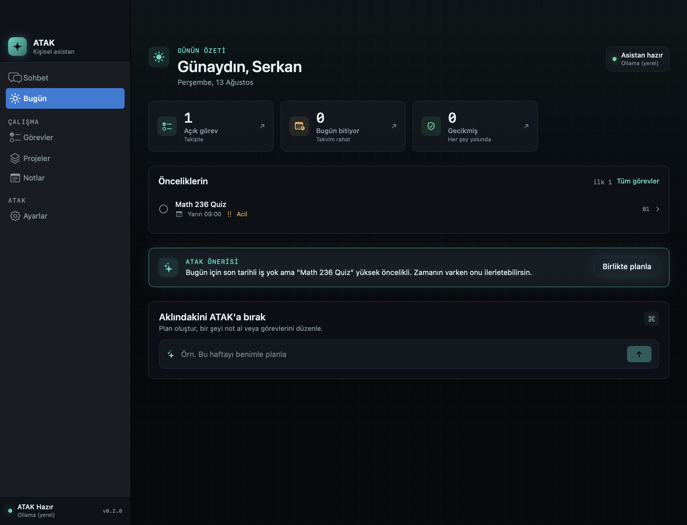
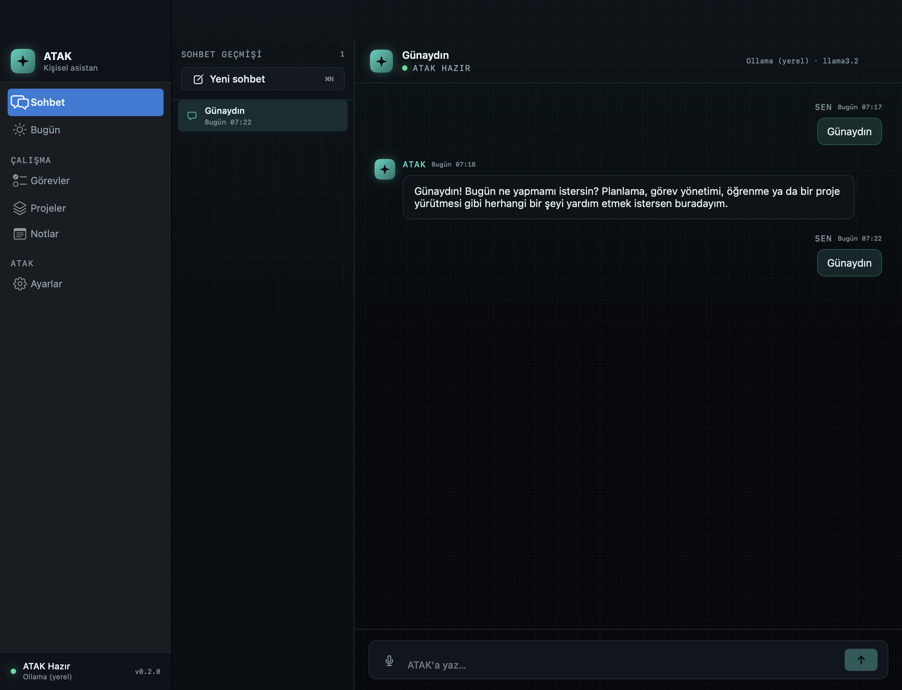
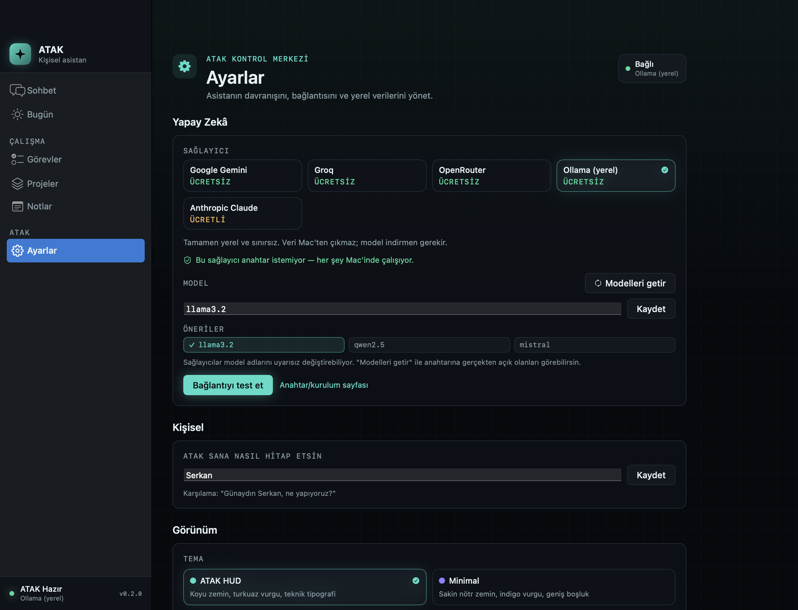

# ATAK — Kişisel Asistan

A native macOS personal AI assistant, built **without Xcode** — pure SwiftPM, zero third‑party dependencies.

ATAK is more than a chat wrapper. It combines AI chat with tasks, projects and searchable notes, and can safely perform these actions through its built-in tools. Ask it to "add a gym task for tomorrow at 6pm" and it creates the task, then verifies the write before claiming success.

> Türkçe konuşan bir asistan olarak tasarlandı; arayüz ve sistem promptu Türkçedir.
> Mimari dokümanı: [`docs/MIMARI.md`](docs/MIMARI.md) (Türkçe, 16 bölüm).



| Chat with tool use | Provider settings |
|---|---|
|  |  |

<sub>Screenshots are rendered by the app itself — <code>ATAK_SHOT=&lt;dir&gt; open -a ATAK</code> adds a capture menu item that draws the window's own view hierarchy to PNG. No Screen Recording permission involved, and no desktop or cursor bleeding into the frame. See <a href="Sources/ATAKCore/Utilities/WindowCapture.swift"><code>WindowCapture.swift</code></a>.</sub>

---

## Why this is interesting

**It was built on a machine with no Xcode.** Only Command Line Tools. That single constraint shaped the whole architecture, and the constraints were *measured*, not assumed:

| Capability | Available under CLT? | Consequence |
|---|---|---|
| SwiftUI, AppKit | ✅ | UI layer is native |
| `@Observable`, most property wrappers | ✅ | — |
| **`@State`** | ❌ macro plugin missing | All view state lives in ViewModels |
| **SwiftData** | ❌ macro plugin missing | Persistence is system SQLite + FTS5 |
| **XCTest** | ❌ not shipped with CLT | Tests use swift‑testing (wired up manually) |
| `xcodebuild`, `.xcodeproj` | ❌ | `.app` bundle assembled and ad‑hoc signed by `make` |

Those turned out to be reasonable trades: SQLite gives full‑text search over notes and memory, and the ViewModel requirement is the architecture the project wanted anyway.

## Architecture

```
Views + ViewModels          SwiftUI, reusable components, two themes
        │
AgentRuntime                budgeted tool loop, cancellable
        │
AI providers · Local tools · Voice
        │
SQLite (WAL + FTS5) · Keychain · Speech · AVFoundation
```

**Concurrency:** Swift 6 strict mode. The database is an `actor`; rows never escape it as reference types — repositories return `Sendable` structs.

### Not locked to one AI provider

```
GeminiProvider              Google Gemini
OpenAICompatibleProvider    one implementation → Groq, OpenRouter, Ollama (local), Mistral, DeepSeek
AnthropicProvider           Claude
```

Each speaks streaming SSE and tool calling, normalised behind a single `AIProvider` protocol. Switching providers is one click; API keys live **only in the Keychain**, never in the database, a file, or logs.

Model names are discovered live from the provider (`Fetch models`) rather than hardcoded — providers retire model IDs without warning, and a stale constant is a silent outage.

### Agent loop

Budgeted and cancellable (5 iterations, 8 tool calls, 120 s). When the budget is hit, ATAK reports how far it got instead of failing silently. Tools available today:

`create_task` · `list_tasks` · `complete_task` · `create_note` · `search_notes` · `create_project`

Every write is read back before ATAK claims it succeeded.

### Turkish full‑text search

SQLite FTS5's `remove_diacritics` cannot fold Turkish **ı** (it is a distinct letter, not an accented *i*), so "çalışma" indexed as "calısma" and searching "calisma" found nothing. Normalisation happens in Swift (`TurkishText.fold`) and is stored in a dedicated column.

### Voice

Push‑to‑talk (⌘M) via `SFSpeechRecognizer` (on‑device when supported), replies spoken with `AVSpeechSynthesizer`. Continuous listening is off by default — the mic opens only when you start it.

## Build

Requires macOS 14+, Swift 6.0+, Command Line Tools. **No Xcode needed.**

```bash
make run       # build, bundle, ad-hoc sign, launch
make test      # 112 tests
make smoke     # isolated headless start-up + DB + FTS5 round trip
make install   # copy to /Applications
```

Build output goes to `~/Library/Developer/ATAK/`, deliberately outside iCloud‑synced folders — the file provider stamps `com.apple.FinderInfo` on build products and `codesign` rejects them.

Data lives in a single file: `~/Library/Application Support/ATAK/atak.db`.

## Status

**v0.2 — professional foundation.** The default Minimal interface now has a consistent three-column chat, actionable dashboard, polished empty/loading/error states, provider onboarding, menu-bar lifecycle and a real application icon. Chat with tool use, tasks, projects, notes with FTS5 search, opt-in voice, two themes and multi-provider AI are working. Privacy Mode keeps both messages and conversation metadata memory-only; note autosave survives fast selection changes. Cloud credentials are restricted to official HTTPS endpoints, Ollama overrides are validated, and local database files use private permissions. 112 tests are green.

Next roadmap: explicit consent/audit/undo for higher-risk tools, stricter end-to-end network deadlines, calendar (EventKit), documents/PDF, focus timer, long-term memory UI, automations and broader UI/provider test coverage. See [`docs/MIMARI.md`](docs/MIMARI.md) §15.

## License

MIT — see [LICENSE](LICENSE).
