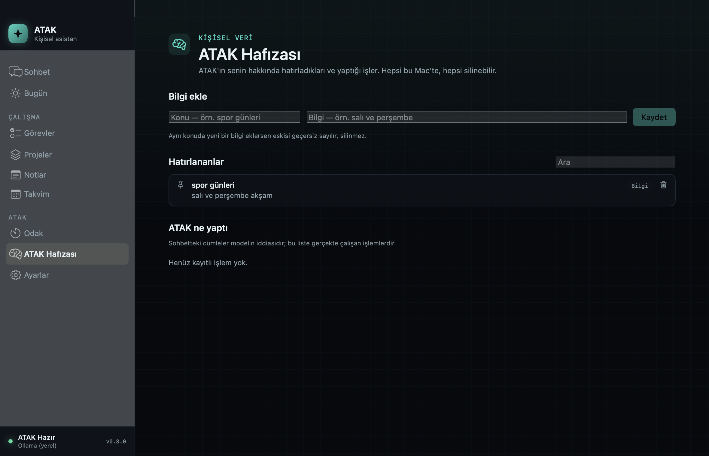
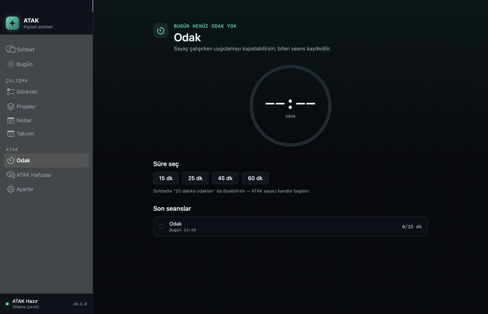

# ATAK — Kişisel Asistan

A native macOS personal AI assistant, built **without Xcode** — pure SwiftPM, zero third‑party dependencies.

ATAK is more than a chat wrapper. It combines AI chat with tasks, projects, searchable notes, your calendar, a focus timer and a long-term memory — and it performs those actions itself through built-in tools. Ask it to "add a gym task for tomorrow at 6pm" and it creates the task, then verifies the write before claiming success. Ask it to put something in your calendar and it stops to ask first.

> Türkçe konuşan bir asistan olarak tasarlandı; arayüz ve sistem promptu Türkçedir.
> Mimari dokümanı: [`docs/MIMARI.md`](docs/MIMARI.md) (Türkçe, 16 bölüm).


| Chat with tool use | Memory + audit log |
|---|---|
|  |  |

| Focus timer | Provider settings |
|---|---|
|  |  |

<sub>Screenshots are rendered by the app itself — <code>ATAK_SHOT=&lt;dir&gt; open -a ATAK</code> adds a capture menu item that draws the window's own view hierarchy to PNG. No Screen Recording permission involved, and no desktop or cursor bleeding into the frame. See <a href="Sources/ATAKCore/Utilities/WindowCapture.swift"><code>WindowCapture.swift</code></a>.</sub>

---

## Why this is interesting

**It was built on a machine with no Xcode.** Only Command Line Tools. That single constraint shaped the whole architecture, and the constraints were *measured*, not assumed:

| Capability | Available under CLT? | Consequence |
|---|---|---|
| SwiftUI, AppKit | ✅ | UI layer is native |
| `@Observable`, most property wrappers | ✅ | — |
| **`@State`** | ❌ macro plugin missing | All view state lives in ViewModels |
| **SwiftData** | ❌ macro plugin missing | Persistence is system SQLite + FTS5 |
| **XCTest** | ❌ not shipped with CLT | Tests use swift‑testing (wired up manually) |
| `xcodebuild`, `.xcodeproj` | ❌ | `.app` bundle assembled and ad‑hoc signed by `make` |

Those turned out to be reasonable trades: SQLite gives full‑text search over notes and memory, and the ViewModel requirement is the architecture the project wanted anyway.

## Architecture

```
Views + ViewModels          SwiftUI, reusable components, two themes
        │
AgentRuntime                budgeted tool loop, cancellable
        │
RiskEngine · ConsentGate    risk classification, user approval, undo
        │
AI providers · Tools · Memory · Calendar · Focus · Voice
        │
SQLite (WAL + FTS5) · Keychain · EventKit · Speech · AVFoundation
```

**Concurrency:** Swift 6 strict mode. The database is an `actor`; rows never escape it as reference types — repositories return `Sendable` structs.

### Not locked to one AI provider

```
GeminiProvider              Google Gemini
OpenAICompatibleProvider    one implementation → Groq, OpenRouter, Ollama (local), Mistral, DeepSeek
AnthropicProvider           Claude
```

Each speaks streaming SSE and tool calling, normalised behind a single `AIProvider` protocol. Switching providers is one click; API keys live **only in the Keychain**, never in the database, a file, or logs.

Model names are discovered live from the provider (`Fetch models`) rather than hardcoded — providers retire model IDs without warning, and a stale constant is a silent outage.

### The bug that ate every reply

Gemini connected, returned `200`, and the chat stayed empty. Two plausible theories (thinking budget, changed API surface) were both wrong. Dumping the raw SSE bytes settled it in seconds: Gemini sends **no blank line between events**, so a spec‑literal parser that only emits on `\n\n` merges two JSON objects into one buffer, which stops being valid JSON — and the reply disappears without an error.

[`SSE.Parser`](Sources/ATAKCore/AI/SSE.swift) is therefore a line‑fed state machine that also flushes when the buffer is already complete JSON. It is pure, so the real payload that broke it is now a regression test ([`AITests.swift`](Tests/ATAKTests/AITests.swift), suite *Gerçek Gemini akışı*) with no HTTP involved.

The lesson generalised into a rule for the rest of the project: on an integration failure, look at the real bytes before reading the documentation.

### Agent loop

Budgeted and cancellable (5 iterations, 8 tool calls, 120 s). When the budget is hit, ATAK reports how far it got instead of failing silently. Tools available today:

`create_task` · `list_tasks` · `complete_task` · `create_note` · `search_notes` · `create_project` · `remember` · `recall` · `query_calendar` · `find_free_time` · `create_calendar_event` · `start_focus_timer`

Every write is read back before ATAK claims it succeeded.

### Risk, consent and undo

Every tool call runs the same pipeline — **safety card → risk → consent → execute → verify → audit log** — and the tools themselves know nothing about it. Security decisions live in one place.

Risk is not a constant. It escalates with context:

```
base risk from the tool's safety card
+1  if the action is irreversible
+1  if it touches more than 5 records
+1  if data leaves the device
+1  if the input came from content ATAK read, not from the user
```

That last rule is the real defence against prompt injection: anything derived from a document, page or email is asked about, even when the tool itself is low-risk. Memory writes from read content are rejected outright at the service layer — a planted "fact" would otherwise live in the system prompt forever.

Consent cards default to **Cancel**, bind Return to Cancel, and never offer "don't ask again". If no gate is wired up, the default is **deny** — a misconfiguration should not become a silent security hole.

Anything ATAK does is written to `assistant_action`, and the medium-risk tools that run without asking are undoable in one click. The chat transcript is the model's *claim*; that table is what actually ran.

### Long-term memory

Separate from chat history: the window forgets, memory does not. A bounded digest (pinned first, then most used) is prepended to the system prompt rather than the whole store — otherwise memory quietly inflates the token bill on every request. Everything ATAK knows about you is visible and deletable on one screen, and a new value for an existing key supersedes the old one instead of deleting it: how the memory changed is information too.

### Turkish full‑text search

SQLite FTS5's `remove_diacritics` cannot fold Turkish **ı** (it is a distinct letter, not an accented *i*), so "çalışma" indexed as "calısma" and searching "calisma" found nothing. Normalisation happens in Swift (`TurkishText.fold`) and is stored in a dedicated column.

### Voice

Push‑to‑talk (⌘M) via `SFSpeechRecognizer` (on‑device when supported), replies spoken with `AVSpeechSynthesizer` (Turkish voice, markdown stripped before reading).

Voice is **opt‑in and off by default** — both the launch greeting and spoken replies are switched on in Settings → Ses. Continuous listening does not exist: the mic opens when you start it and closes when you stop it, never on its own.

Speech *output* needs no permission at all; only listening asks for the microphone and Speech Recognition. The two are kept independent, so a denied mic never costs you audio.

## Build

Requires macOS 14+, Swift 6.0+, Command Line Tools. **No Xcode needed.**

```bash
make run       # build, bundle, ad-hoc sign, launch
make test      # 160 tests
make smoke     # isolated headless start-up + DB + FTS5 round trip
make install   # copy to /Applications
```

Build output goes to `~/Library/Developer/ATAK/`, deliberately outside iCloud‑synced folders — the file provider stamps `com.apple.FinderInfo` on build products and `codesign` rejects them.

Data lives in a single file: `~/Library/Application Support/ATAK/atak.db`.

## Status

**v0.3 — the action engine.** Risk classification, consent gate, audit log and undo are live, and the schema's long-dormant tables (`assistant_action`, `memory_item`, `timer_session`) are finally in use. Calendar (EventKit) reads freely and writes only with consent; long-term memory, and a focus timer with persisted sessions round out the release. 160 tests are green.

<details>
<summary>v0.2 — professional foundation</summary>

**v0.2.** The default Minimal interface now has a consistent three-column chat, actionable dashboard, polished empty/loading/error states, provider onboarding, menu-bar lifecycle and a real application icon. Chat with tool use, tasks, projects, notes with FTS5 search, opt-in voice, two themes and multi-provider AI are working. Privacy Mode keeps both messages and conversation metadata memory-only; note autosave survives fast selection changes. Cloud credentials are restricted to official HTTPS endpoints, Ollama overrides are validated, and local database files use private permissions.

</details>

Next roadmap: documents/PDF reading (with the untrusted-content path the risk engine already anticipates), Reminders sync, stricter end-to-end network deadlines, automations, and broader UI/provider test coverage. See [`docs/MIMARI.md`](docs/MIMARI.md) §15.

## License

MIT — see [LICENSE](LICENSE).
